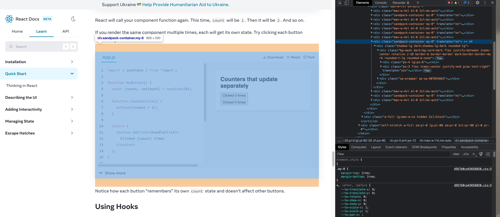

import { Sandpack } from "@codesandbox/sandpack-react";

When I was reading [React Docs Beta](https://beta.reactjs.org/learn#sharing-data-between-components), I found an editable code block and its live rendering result on that page.
I was wondering how to do so and maybe I could use this tool for my own website. Then I opened the chrome console and seleted the element I was interested in and found the corresponding html code like below:

The div has a class attribute "sandpack-container" that sounds like sandbox. So I googled it and this is what I found:

And this is what we will discuss.

## Sandpack
### What is Sandpack
On their [website](https://sandpack.codesandbox.io/), it says that:

> A component toolkit for creating live-running code editing experiences, using the power of CodeSandbox.

### Running Example
Following [Sandpack's Docs](https://sandpack.codesandbox.io/docs/), I added this running Sandpack react component for writting React below. Feel free to give it a try!

<Sandpack template="react"></Sandpack>
