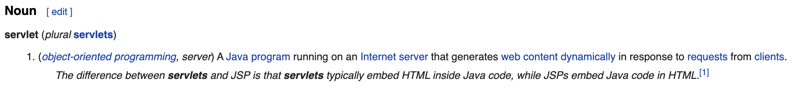
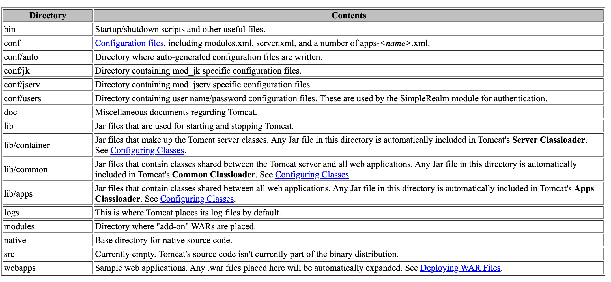
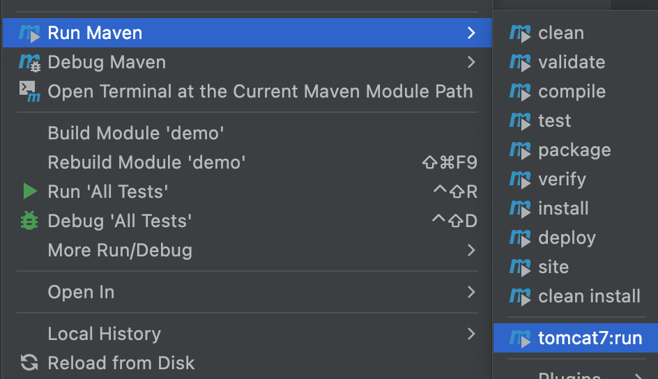

## About Apache Tomcat
So what is Tomcat? Roughly speaking, it is a Java Servelet container.

So what is Servelet? I found it helpful to understand the word from an Etymology aspect.
1. On [Wikitionary](https://en.wiktionary.org/wiki/servlet), it says that servlet is just a "Blend of server + applet".
2. You may have questions about what does "applet" mean if you are also a non-native English speaker or haven't seen this word before. On [Wikitionary](https://en.wiktionary.org/wiki/applet#English), it says that applet is just "app + -let". "-let" is a" diminutive suffix that attached to nouns"(from [this](https://www.dictionary.com/browse/-let#:~:text=%2Dlet,noun%20(anklet%3B%20wristlet))).

Etymology knowledge above just helps me better understand these fancy words. Now based on my understanding:
1. "-let" is a suffix in English. Attaching "-let" after some nouns could make a word whose meaning is just a small part or piece of the object that noun refers
2. "applet" is just a small part of an app
3. "servelet" is a small part of an app that has something to do with the server

Now let's check the description from those official documents. It just makes more sense to me after all these seemly boring Etymology analysis:
  * applet (from [wikitionary](https://en.wiktionary.org/wiki/applet#English))
   
  * servlet (from [wikitionary](https://en.wiktionary.org/wiki/servlet))
   

We could also check detailed definition and explanation at [JavaEE 6 Docs](https://docs.oracle.com/javaee/6/api/javax/servlet/Servlet.html#:~:text=A%20servlet%20is%20a%20small,servlet.):

> `public interface Servlet`  
> Defines methods that all servlets must implement. A servlet is a small Java program that runs within a Web server. Servlets receive and respond to requests from Web clients, usually across HTTP, the HyperText Transfer Protocol. To implement this interface, you can write a generic servlet that extends javax.servlet.


So based on the official docs, `Servlet` is just a Java interface. 

To sum up, we could write Java code to implement Servelet and put those code into Apache Tomcat and then we could run these code. We will see how to do that soon.


## Apache Tomcat Quick Start
My device:
- macOS Monterey 12.0.1
- Macbook Pro M1 2020

### How to Install Tomcat Locally
1. Install Apache Tomcat on its (official website)[https://tomcat.apache.org/]. I chose to download Tomcat Version 8 in zip.
2. Unzip it wherever you want.

### Tomcat Directory Structure
To better understand Tomcat, let's check its directory structure. I found something userful from Tomcat [docs](https://tomcat.apache.org/tomcat-3.3-doc/tomcat-ug.html#directory_structure):


We should pay more attention to those folders: `bin`, `conf`, `webapps`.
- `bin`: excutable files
- `conf`: configurations
- `webapps`: web applications

### How to Start a Tomcat Server
3. In terminal, find the `start.sh` file under `bin` folder. If you are in windows OS, you should run `start.bat` instead.
4. Before run it, give permissions to all files ending with `.sh` by running the command below in terminal:  
   `chmod +x *.sh`
5. Now we could run `./start.sh` in terminal.  
   Make sure you are under `./apache-tomcat-{version}/bin/`.
6. The terminal will show something like below:
   

   Check at [localhost:8080](localhost:8080), you will see something like below:
   

### How to End a Tomcat Server
To end a tomcat server in terminal, run
```
pkill -9 -f tomcat
```
(from [stackoverflow](https://stackoverflow.com/questions/15236308/how-do-i-kill-this-tomcat-process-in-terminal))


### How to Configure a Tomcat Server
We could configure a Tomcat server in its `/conf/server.xml` file.

Say we want to change the PORT. We could configure Tomcat's PORT in `/conf/server.xml`. Changing the `port` value is all we need to do.


Specifically, if we configure the PORT as `80`, then we could visit the local Tomcat server without specifying the port on browser url with just `localhost`. This is because `80` is also the PORT for HTTP.


### How to Deploy an Application in Tomcat?
All we need to do is put files under `webapps` directory. There are some ways to do so:
1. Simply copy original files and paste them under `webapps` directory
2. Convert original files into `.war` files, copy those `.war` files and paste them under `webapps` directory. As the [docs](https://tomcat.apache.org/tomcat-3.3-doc/tomcat-ug.html#directory_structure) specified, "Any .war files placed here will be automatically expanded".


## How to Integrate Tomcat in Intellij IDEA?
### Add Local Tomcat Server
Check the Intellij IDEA's guide on Tomcat Server.
> [Run/Debug Configuration: Tomcat Server](https://www.jetbrains.com/help/idea/run-debug-configuration-tomcat-server.html)

### Add Tomcat Plugin in `pom.xml`
We could also add Tomcat through `pom.xml`.

1. Add Tomcat plugin in `pom.xml`:
   

2. Use Maven Helper (download from [marketplace](https://plugins.jetbrains.com/plugin/7179-maven-helper)) to start the project:
   
