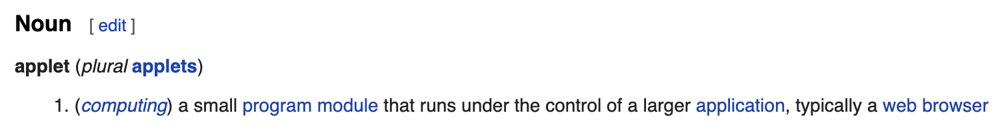

## About Servlet  
So what is Servelet? Google Search results say:
> A servlet is a small Java program that runs within a Web server.

I found it helpful to understand the word from an Etymology aspect.
1. On [Wikitionary](https://en.wiktionary.org/wiki/servlet), it says that servlet is just a "Blend of server + applet".
2. You may have questions about what does "applet" mean if you are also a non-native English speaker or haven't seen this word before. On [Wikitionary](https://en.wiktionary.org/wiki/applet#English), it says that applet is just "app + -let". "-let" is a" diminutive suffix that attached to nouns"(from [this](https://www.dictionary.com/browse/-let#:~:text=%2Dlet,noun%20(anklet%3B%20wristlet))).

Etymology knowledge above just helps me better understand these fancy words. Now based on my understanding:
1. "-let" is a suffix in English. Attaching "-let" after some nouns could make a word whose meaning is just a small part or piece of the object that noun refers
2. "applet" is just a small part of an app
3. "servelet" is a small part of an app that has something to do with the server

Now let's check the description from those official documents. It just makes more sense to me after all these seemly boring Etymology analysis:
  * applet (from [wikitionary](https://en.wiktionary.org/wiki/applet#English))
   
  * servlet (from [wikitionary](https://en.wiktionary.org/wiki/servlet))
   

We could also check detailed definition and explanation at [JavaEE 6 Docs](https://docs.oracle.com/javaee/6/api/javax/servlet/Servlet.html#:~:text=A%20servlet%20is%20a%20small,servlet.):

> `public interface Servlet`  
> Defines methods that all servlets must implement. A servlet is a small Java program that runs within a Web server. Servlets receive and respond to requests from Web clients, usually across HTTP, the HyperText Transfer Protocol. To implement this interface, you can write a generic servlet that extends javax.servlet.

So based on the official docs, `Servlet` is just a Java interface. 

To sum up, we could write Java code to implement Servelet and put those code into Apache Tomcat and then we could run these code. We will see how to do that soon.

## Servlet Quick Start
1. Create a new Java EE project in Intellij IDEA
2. Import `Servlet` dependency in `pom.xml`
3. Create a new class that implements `Servlet` interface. Override all methods needed(`init()`, `service()` etc.)
4. Configure path using annotation `@WebServlet("/demo1")`
5. Run the project with Apache Tomcat and visite the `Servlet`

## `Servlet` as an Interface
As we discussed above, `Servlet` is a Java interface. It difines 5 methods that all classes implementing `Servlet` must override these methods:

More details on [Java EE 6](https://docs.oracle.com/javaee/6/api/javax/servlet/Servlet.html).

We should pay more attention on `service()` method, since this method handles requests  and generates responses.

## `HttpServlet`
As the name indicates, `HttpServlet` is just a special type of `Servlet`. `HttpServlet` is an abstract Java class implementing `Servlet` interface.

As we could see on Java EE docs:
- `public abstract class HttpServlet extends GenericServlet` 
  (from [this](https://docs.oracle.com/javaee/7/api/javax/servlet/http/HttpServlet.html))
- `public abstract class GenericServlet extends Object implements Servlet, ServletConfig, Serializable`
  (from [this](https://docs.oracle.com/javaee/7/api/javax/servlet/GenericServlet.html))

`HttpServlet` is important because today we usually build server for browser and browser communicate with server on HTTP protocol.

How does `HttpServlet` work? I think [Java EE docs](https://docs.oracle.com/javaee/7/api/javax/servlet/http/HttpServlet.html) could give us some hints:
> There's almost no reason to override the service method. service handles standard HTTP requests by dispatching them to the handler methods for each HTTP request type (the doXXX methods listed above).
We could even implement our own `HttpServlet`:
1. Cast the incoming request from `ServletRequest` type into `HttpServletRequest` type
2. Check HTTP method name
3. Based on HTTP method name of the request, dispatch it to corresponding handler method
The handler methods we metioned above, is just the `doXXX` method in [Java EE HttpServlet](https://docs.oracle.com/javaee/7/api/javax/servlet/http/HttpServlet.html)

## Configure `urlPattern` of `Servlet`
To be able to handle request, a `Servlet` need to have its own URLs.

We could configure a `Servlet`'s URL by annotation `@WebServlet`.
